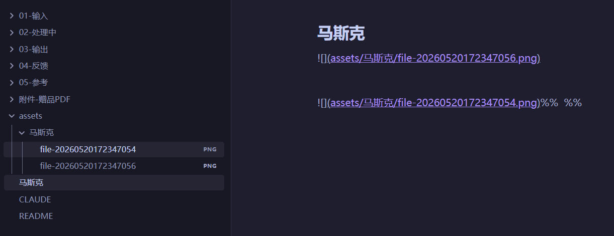
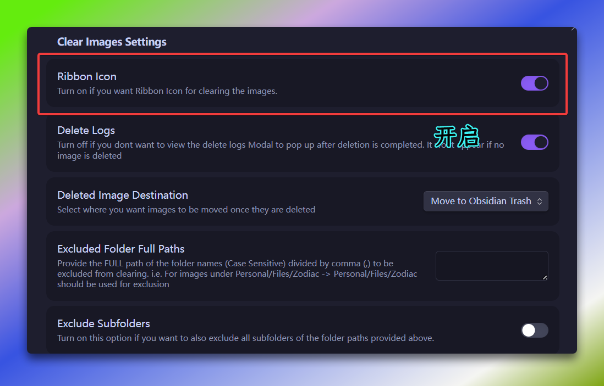

插件：Custom Attachment Location

笔记的生命力，藏在那些不会失效的附件里。

深耕 Obsidian 写作许久愈发察觉，最先乱掉的从不是文字内容，而是杂乱无章的图片附件。初期毫无察觉，日积月累文件增多，各类附件乱象接踵而至。

而 Custom Attachment Location 插件完美化解难题，统一规范图片为标准 Markdown 格式，适配各类编辑器与 GitHub 平台正常展示，让本地库附件井然有序，彻底告别路径错乱、链接失效等困扰。


# 插件设置

1. 附件重命名模式→全部
2. 是否重命名附件文件→开启✅*
3. Markdown URL格式填写（位置在插件页底部位置）

```Plain
assets/${noteFileName}/${generatedAttachmentFileName}
```

# 文件与链接
1. 內部链接类型→基于当前笔记的相对路径
2. 使用wiki链接→取消 (特别容易忽略)
关闭后，在笔记中链接其他笔记或图像时，使用如[[文件名]]和!Ⅲ[图片名]]这样的Wiki链接。此选项则默认使用标准的Markdown 超链接语法。


**说明：**
1. 删除笔记（含有图片），笔记不在→图依然在。
2. 图片删除，笔记中的图片链接不在
3. 你对笔记进行重命名的时候，附件的子文件夹也进行了重命名，图片链接也自动进行了更新

>⚠️注意：
>对笔记进行重命名后，附件的子文件夹未进行重命名，图片链接也未自动进行更新
>可尝试卸载重新安装插件再尝试。




# 补充：插件

```
Clear Unused Images
```
建议安装这个插件，可以实现本地图片没有被文章引用，安装后把**Ribbon Icon**功能开启
点击功区**类似相册图标按钮**就会全都清除掉没有被文章引用本地图片




# 补充：规则解释

### 新附件位置
```
./assets/${noteFileName}
```

为每篇笔记创建独立的附件文件夹，格式为：当前笔记所在目录/assets/[笔记名]/

| 部分                | 含义                                   |
| ----------------- | ------------------------------------ |
| `./`              | 相对路径，代表**当前笔记所在的文件夹**                |
| `assets/`         | 统一的附件根目录，所有笔记的附件都会放在这个文件夹下           |
| `${noteFileName}` | 插件变量，会自动替换为**当前笔记的文件名**（不含 `.md` 后缀） |
### 生成的附件文件名

默认的
```
file-${date:{momentJsFormat:'YYYYMMDDHHmmssSSS'}}
```

高级点
```
file-${date:{momentJsFormat:&#x27;YYYYMMDDHHmmssSSS&#x27;}}
```

自动生成带毫秒时间戳的文件名，避免重名冲突

### Markdown URL 格式

```
assets/${noteFileName}/${generatedAttachmentFileName}
```

这个决定了笔记里怎么写图片链接。它必须和第一项“新附件位置”的实际存储路径保持一致。不然 Obsidian 能找到文件、但笔记里的链接指向了错误的位置，图片就显示不出来。

笔记的生命力，藏在那些不会失效的附件里。